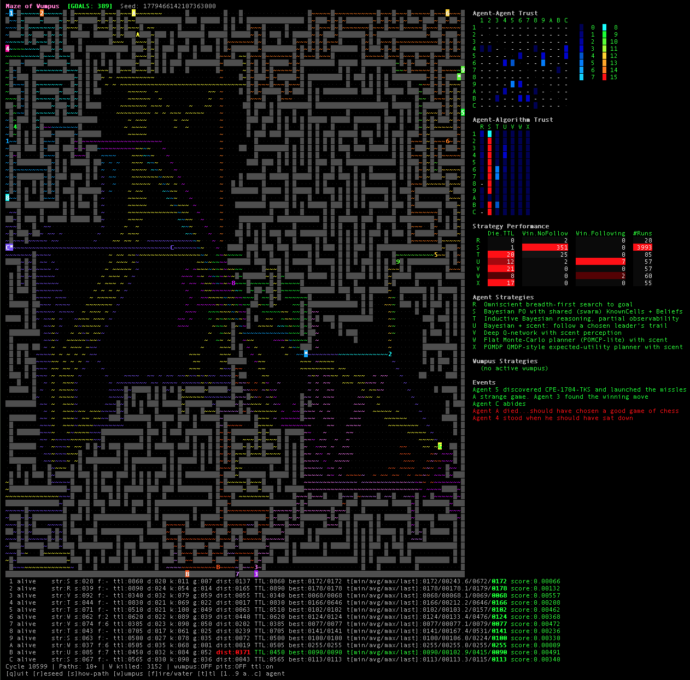

# maze-of-wumpus

<p align="center">
  
</p>

A terminal-UI maze game written in Go that pits **twelve labeled agents** —
each spawning at its own perimeter doorway — running a **per-journey
rotation of seven decision algorithms** against a procedurally-generated
120 × 80 maze under strict partial observability. The roster covers an
omniscient breadth-first benchmark, a swarm of Bayesian agents that pool
perceived terrain, the canonical inductive-Bayesian Wumpus-World
reasoner, a scent-following hive learner, a deep Q-network, a
flat-Monte-Carlo POMCP planner, and a QMDP-style POMDP utility planner.

Hazards (wumpus, fire pits, water pits) and the time-to-live death rule
toggle on and off live; movement is 8-direction Moore-connected with
corner-clipping; pathfinding is weighted Dijkstra (cardinal = 10,
diagonal = 14); perception is wall-respecting BFS out to a 100-cell
sight radius and a 2-cell smell radius (independent — sight uses
KnownCells, smell uses ScentSensedCells). The right side of the maze
renders two trust heatmaps (agent → agent and agent → algorithm), a
per-strategy run-outcome table with column-normalized heat backgrounds,
two strategy legends (agent + wumpus), and a 5-line Events log with
context-aware snark drawn from pop-culture and literary references.

Code lives under `src/` with a thin `cmd/maze-of-wumpus` entry; all
tests, `go vet`, and `gofmt` pass.

---

## Contents

- [Quick start](#quick-start)
- [Screenshot](#screenshot)
- [Project layout](#project-layout)
- [The world](#the-world)
- [Movement, perception, and pathfinding](#movement-perception-and-pathfinding)
- [Agents](#agents)
- [Per-agent entries and TTL](#per-agent-entries-and-ttl)
- [Strategies](#strategies)
- [Per-journey strategy selection](#per-journey-strategy-selection)
- [Quorum and singleton constraints](#quorum-and-singleton-constraints)
- [Scent / trust system](#scent--trust-system)
- [Post-win path optimizer](#post-win-path-optimizer)
- [Solo graph pruning (T, U, V, W, X)](#solo-graph-pruning-t-u-v-w-x)
- [Swarm graph pruning (S)](#swarm-graph-pruning-s)
- [Wumpus](#wumpus)
- [Hazards and toggles](#hazards-and-toggles)
- [Cycle phase order](#cycle-phase-order)
- [UI annex](#ui-annex)
- [Per-agent status row](#per-agent-status-row)
- [Glyphs and color legend](#glyphs-and-color-legend)
- [Controls](#controls)
- [Command-line modes](#command-line-modes)
- [Logs](#logs)
- [Make targets](#make-targets)
- [Determinism](#determinism)
- [Constants reference](#constants-reference)

---

## Quick start

```bash
make build                # produces ./build/maze-of-wumpus
./build/maze-of-wumpus    # launch the TUI:
                          #   - all 12 agents enabled, simultaneous spawn
                          #   - hazards (wumpus, fire pits, water pits) OFF
                          #   - TTL ON
```

Headless mode for scripted runs and CI (deterministic):

```bash
./build/maze-of-wumpus --headless --steps=200 --seed=42
```

### Screenshot

<p align="center">
  
</p>

A mid-game capture (seed `1779466142107363000`, cycle 10599, 389 goals
reached). Reading the screen left to right:

- **Top-left status bar:** seed, cumulative GOALS counter, controls
  footer.
- **The maze:** 120 × 80 grid. Path cells render as the dim `·`,
  walls as the dark gray `█`. Bright `S` squares on the perimeter
  are the per-agent doorways — each agent's home cell is rendered
  in that agent's identity color with a white copy of the agent's
  own label (the visible `1`, `4`, `5`, `6`, `9`, `A`, `B`, `C` on
  the edges). The yellow-on-green `G` is the goal cell; the bright
  `·` blocks scattered across the corridors are scent breadcrumbs
  in the depositing agent's color (long horizontal cyan strokes are
  agent 5's QMDP trail). Agents in-play are the colored label glyphs
  on the maze interior (e.g., a magenta `C` mid-board, a green `9`
  on the east side).
- **Right-side annex, top to bottom:**
  - **Agent-Agent Trust** matrix with the 16-step heat legend
    spliced into the right edge. Blue cells show small positive
    trust scores; the diagonal `·` is each agent's own row.
  - **Agent-Algorithm Trust** matrix — agent rows × strategy
    columns (R/S/T/U/V/W/X). The first column is mostly red because
    `R` is the omniscient benchmark and everyone trusts it; the
    other columns show the slower accrual of trust across the PO
    strategies.
  - **Strategy Performance** table with column-normalized heat
    backgrounds — `S` dominates the `Win.NoFollow` and `#Runs`
    columns thanks to its 11-entity swarms; `T` and `U` lead the
    `Die.TTL` column; `R` (omniscient) hasn't died but only racked
    up two wins because at most one R-agent is alive at a time.
  - **Agent Strategies / Wumpus Strategies** legends.
  - **Events** panel: a rolling 5-line log of snark templates fired
    from the goal/death/system pools (here showing two recent goal
    reaches and three deaths, including one of the literary TTL
    references).
- **Bottom rows (one per agent):** label, alive/dead, current
  strategy letter, lifetime starts, current trustee, learned-TTL
  belief, deaths, kills, goals, current-life distance with per-agent
  TTL ceiling (red-highlighted when close to expiry — see agent B's
  `dist:0371` against `TTL:0450`), best solve metrics, solve-time
  aggregates, cumulative score.
- **Bottom status line:** cycle number, paths count, wumpus-killed
  counter, hazard toggle states, controls help.

---

## Project layout

```
cmd/maze-of-wumpus/
    main.go              # CLI entry: runApp / runHeadless / runHeadlessLoop /
                         #   reseedHeadless / writeHeadlessState
    announce_darwin.go   # macOS-only async `say` call at TUI launch
    announce_other.go    # no-op stub for every other OS
    main_test.go         # unit tests (cmd-layer)
    e2e_test.go          # subprocess e2e tests: build the binary, run it,
                         #   assert stdout schema, exit codes, determinism
src/
    world/               # World, Agent, Wumpus, Maze; tick loop; toggles;
                         #   trust + strategy state; events; swarm-graph
                         #   pruning; per-agent prune; post-win optimizer;
                         #   solve_log / stats_log writers
    strategy/            # Seven strategies (R..X) + factory + helpers
                         #   (Bayesian planning core, wall-respecting BFS,
                         #   water override, branch-decision animation)
    wumpus/              # Wumpus hunt strategies + crowd sightings
    tui/                 # Bubbletea Model, glyphs (incl. per-agent entrance
                         #   glyphs), trust matrices, strategy perf table,
                         #   events panel
docs/img/                # README logo
Makefile                 # build / lint / test / coverage / clean / run
```

`world.Config` injects strategy callbacks (`StrategyForLetter`,
`StrategyLetters`, `StrategyDescriptionForLetter`, `WumpusStrategy`,
`VengeanceStrategy`) at construction so `src/world` stays free of
strategy-package imports. The world package owns three layering
constants — `SwarmStrategyLetter = 'S'`, `BenchmarkStrategyLetter = 'R'`,
and `StrategyUsesScent(letter)` — to make a few strategy-aware decisions
without circular imports.

---

## The world

- **Board:** 120 × 80 grid (`BoardWidth = 120`, `BoardHeight = 80` =
  9600 cells).
- **Canonical entrance:** `(1, 0)` — top edge, non-corner.
- **Goal:** uniformly-random walkable cell at Manhattan distance ≥
  `MinGoalDistanceCells = (BoardWidth + BoardHeight) / 2 = 100` from the
  canonical entrance.
- **Cell types:** `CellWall`, `CellPath`, `CellEntrance`, `CellGoal`,
  `CellFirePit`, `CellWaterPit`.
- **Maze generation:** a single connected component, two variants:
  - **Recursive-backtracker maze** (`1 − OpenFieldProbability = 80%`):
    classic 2-cell-jump carve from `(0, 0)`, then 4–10 irregular flood
    rooms (target area in `[MinRoomArea = 4, MaxRoomArea = 2500]`,
    bounding-box ≤ `MaxRoomDim = 50`).
  - **Open-field** (`OpenFieldProbability = 20%`): every interior cell
    walkable, perimeter walled.
- **Hazards:** wumpus (varying hunt modes + aggressiveness), fire pits,
  water pits. All disabled at construction; enabled live via toggles.
- **Derived grids:** `Heat[y][x]` (1-cell envelope around fire pits),
  `Stench[y][x]` (1-cell envelope around live wumpus, recomputed every
  tick), `ScentOwner[y][x]` (agent label that most recently stepped
  there), `ScentCycle[y][x]` (tick of that deposit; freshness decays
  linearly to 0 over `ScentMaxAge = 1000` cycles).
- **One RNG:** `World.Rng *rand.Rand` is the single deterministic source.
  Same seed → identical run (including which snark templates fire in the
  Events panel — `pickTemplate` consumes from the same RNG).

---

## Movement, perception, and pathfinding

**Connectivity.** Movement uses the 8-direction Moore neighborhood:
`Cardinals` is `[N, S, W, E, NW, NE, SW, SE]`. The first
`CardinalCount = 4` entries are the strict cardinals. Diagonal moves
honor a **corner-clipping rule** (`IsCornerClipped`): a diagonal step
from `cur → np` is rejected when *both* of the orthogonal cells `cur`
shares with `np` are walls — i.e., the agent can't squeeze through a
one-cell wall gap.

**Weighted Dijkstra.** All pathfinding (planner BFS, post-win optimizer,
swarm prune, water override) routes via `World.DijkstraPath`, with
`CardinalStepCost = 10` and `DiagonalStepCost = 14 ≈ 10 · √2`. The
priority queue uses Go's `container/heap` interface — extract-min is
O(log V). Path reconstruction appends + reverses (linear), not the
quadratic prepend the prior implementation used.

**Sight perception.** `MarkAgentSensed(a)` runs a wall-respecting,
Moore-connected BFS from `a.Pos` out to `a.SightRadius`
(default `DefaultSightRadius = 100`). Cells the BFS reaches enter
`a.KnownCells`. Walls also enter `KnownCells` (the agent learns where
walls are) but block propagation — the agent can't see past walls. A
**wall-adjacency rule** also fires at the boundary: when a path cell is
dequeued at depth = radius, its 8 Moore neighbors get marked in
`KnownCells` (no further propagation). This lets the agent recognize
dead-ends (1 walkable neighbor), corners (perpendicular walkable
neighbors), and junctions (≥ 3 walkable neighbors) from a distance.

**Smell perception.** `ScentSensedCells(a)` is the *olfactory* analog —
a separate Moore-BFS out to `a.SmellRadius` (default `DefaultSmellRadius
= 2`). Walls block propagation but are NOT included in the sensed set
(walls carry no scent). At the default radius the sensed set is up to
25 cells (5×5 minus walls).

**Strict partial observability.** Every PO-respecting strategy (T, U,
V, W, X) gates `w.Maze.GoalPos` reads on `a.KnownCells[w.Maze.GoalPos]`.
An agent that hasn't perceived the goal cell never routes to it,
regardless of its planner. The omniscient strategies (R, and the legacy
DFS still wired to label 2) are the only consumers of `w.Maze.GoalPos`
without that gate.

---

## Agents

Twelve agents live on the board, labels `1..9` and `A..C`. Labels are
identities only — every agent carries the **union of state slots** any
strategy might need (`Beliefs` for Bayesian PO; `DQN` weights;
`KnownCells`; `TrustScores`; `StrategyTrustScores`; per-agent
`PrunedKnownCells` cache) and the running strategy is decided **per
journey**.

| Label | Default strategy (label tier) | Notes                          |
|:-----:|:------------------------------|:-------------------------------|
| 1     | BFS                           | Leader (scent leader)          |
| 2     | DFS                           | Leader                         |
| 3     | Bayesian                      | Leader                         |
| 4     | ScentFollower                 | Follower-eligible              |
| 5     | DQN                           | Follower-eligible              |
| 6     | POMCP                         | Follower-eligible              |
| 7     | QMDP                          | Follower-eligible              |
| 8     | Bayesian                      | Leader                         |
| 9     | ScentFollower                 | Follower-eligible              |
| A     | DQN                           | Follower-eligible              |
| B     | POMCP                         | Follower-eligible              |
| C     | QMDP                          | Follower-eligible              |

`ScentLeaderLabels = {1, 2, 3, 8}` — agents that other followers can
follow but who never follow anyone. `ScentFollowerLabels = {4, 5, 6, 7,
9, A, B, C}` — agents that participate in the trustee-pick / scent
system. Note that the strategy a follower runs on any given journey is
chosen by `PickStrategy` — the table above is just the *default*
mapping used by `strategy.ForLabel`.

**Perception.** All twelve agents share the uniform defaults:
`SmellRadius = 2`, `SightRadius = 100`. The earlier "far-sight"
distinction (where labels 8/9/A/B/C had a boosted sensing radius) is
gone — perception is uniform across the roster, varying only by
spawn position.

---

## Per-agent entries and TTL

Every agent has its OWN perimeter entry cell, picked at world
construction:

- **`pickAgentEntrances`** chooses 12 distinct cells from the four
  maze sides (top, bottom, left, right), excluding corners and the
  goal, distributed across the four sides via round-robin sampling.
  Each pick must satisfy a minimum-distance-from-goal constraint
  (`MinGoalDistanceCells / 2 = 50` Manhattan).
- **`carveEntryConnection`** ensures the picked perimeter cell is
  walkable AND connected to the rest of the maze: if the cell's
  inward neighbor is wall, a straight corridor is carved inward
  until existing path is reached, then the connection to the goal
  is verified via Dijkstra. A perimeter cell whose carve doesn't
  reach the goal is rejected; the picker tries another side.
- **`initAgentEntrance`** stamps the picked entry onto an agent:
  `EntrancePos`, `OptimalDistance` (shortest-path length from this
  entry to goal), `ShortestPath` (cells on a Dijkstra-min path), and
  a per-agent `DistFromStart[y][x]` BFS table from the entry.
- **Spawn.** `RespawnAgents` places each agent at its own
  `EntrancePos`; the previous "stagger across the first 11 ticks"
  is gone — every agent has `RespawnIn = 1` and they all enter on
  the first tick. The visual rollout is provided by *spatial*
  distribution (12 doors across 4 sides), not temporal staggering.
- **TTL.** The kill rule is `ActualDistance > TTLMultiplier ×
  a.OptimalDistance` — **per agent**. Agents spawning closer to the
  goal get a tighter TTL window; agents far from goal get a generous
  one, scaled to the actual difficulty of their start. The TUI's
  dist-color severity (yellow at ≥ 75% of TTL cap, red at ≥ 80%) uses
  the per-agent TTL too.

---

## Strategies

Seven distinct algorithms, each identified by a letter (R..X) and
selectable by any agent on any journey via `PickStrategy`:

| Letter | Name              | Short description                                                     | PO? | Scent? |
|:------:|:------------------|:----------------------------------------------------------------------|:---:|:------:|
| **R**  | bfs               | Omniscient breadth-first search to goal (Dijkstra-backed)             | no  | no     |
| **S**  | swarm-bayesian    | Bayesian PO with shared (swarm) `KnownCells` + `Beliefs`              | yes | no     |
| **T**  | bayesian          | Inductive Bayesian reasoning, strict partial observability            | yes | no     |
| **U**  | scent-follower    | Bayesian belief layer + scent-following decision rule                 | yes | yes    |
| **V**  | dqn               | Deep Q-network with scent perception                                  | yes | yes    |
| **W**  | pomcp             | Flat Monte-Carlo planner (POMCP-lite) with scent                      | yes | yes    |
| **X**  | qmdp              | POMDP QMDP-style expected-utility planner with scent                  | yes | yes    |

**Strategy R (BFS)** is omniscient — it reads `w.Maze.GoalPos` and
routes via `BFSToward` (Dijkstra over the full walkable graph).
Used as the lower-bound benchmark.

**Strategy S (Swarm-Bayesian)** is the hive-mind variant of T. On every
tick the agent runs `mergeSwarmKnowledge` to union its `KnownCells` and
`Beliefs` with every alive peer also running S (Observed and SafeFromPit
union; PitProb and WumpusProb take the per-cell maximum — cautious
bias). It then constructs a pruned view via `pruneSwarmGraph` (see
[Swarm graph pruning](#swarm-graph-pruning-s)) and runs the shared
Bayesian planning core over the filtered graph.

**Strategy T (Bayesian)** is the canonical Wumpus-World inductive agent:
maintains `Beliefs` (`Observed`, `SafeFromPit`, `PitProb`, `WumpusProb`).
The planning pipeline (`wwPlanPath`) tries, in order:
1. Strict-safe Dijkstra to a known water pit (if `NeedsKnownWater`),
2. Strict-safe Dijkstra to goal (if `KnownCells[GoalPos]`),
3. Strict-safe Dijkstra to the nearest perception-boundary cell (a
   safe perceived cell with at least one unperceived neighbor),
4. Relaxed-safe (not-known-pit) Dijkstra to goal (if goal perceived),
5. Relaxed-safe Dijkstra to a boundary cell.

Strict PO: never routes through cells outside `KnownCells`, never
reads `GoalPos` until perceived. Does NOT consume scent.

**Strategy U (Scent-follower)** runs the same Bayesian belief layer
but its action selection scores each walkable cardinal neighbor by
`safety × freshness` of the trustee's scent, with negative-trust
labels acting as dynamic repels. Falls back to outward-bias
exploration (`DistFromStart` argmax) when no neighbor carries useful
scent.

**Strategy V (DQN)** is a small two-layer MLP. Input is `DqnInput = 14`:
2 normalized position features, 2 walkability bits, 2 hazard bits
(`HeatAt` and `StenchAt`), and 8 Moore-direction scent signed-freshness
features (one per `Cardinals` entry). Output is `DqnOutput = 8` Q-values
(one per Moore direction). One-step TD with the `PendingBonus` reward
channel; ε-greedy exploration (`DqnEpsilon = 0.05`). Water override
applies before the Q-pick when applicable.

**Strategy W (POMCP-lite)** runs `PomcpRollouts = 12` random-walk
rollouts per candidate Moore-direction action, each up to
`PomcpRolloutDepth = 100` steps deep. Rollouts use `Cardinals` (all 8
directions) and weight transitions by `safety × (1 + DistFromStart) ×
scent_factor`. Per-candidate goroutines parallelize the rollouts; each
goroutine gets its own `*rand.Rand` seeded from `World.Rng.Int63()`
consumed in serial before launch, so the run stays deterministic.
Terminal reward (`pomcpGoalReward = 10000`) fires only when the
simulated position is the actual goal cell AND `KnownCells[GoalPos]` is
true.

**Strategy X (QMDP)** is a one-step argmax over Moore-direction actions:
`score = safety × (qmdpExploreWeight × DistFromStart(next) +
qmdpScentWeight × ScentSignedFreshness(next))` where `safety = (1 −
PitProb) × (1 − WumpusProb)`. Fast (no rollouts).

### Per-strategy prune wrapper

T, U, V, W, X all wrap their planning core with `applyAgentPrunedView`:
the per-agent prune (see [Solo graph pruning](#solo-graph-pruning-t-u-v-w-x))
is computed lazily, and `a.KnownCells` is temporarily swapped to the
pruned view for the duration of the call (then restored via `defer`).
The result: planners can't waste effort routing into perceived dead-end
chains.

### Cached-step short-circuit

Before running its native planner each tick, every PO strategy
(T, U, V, W, X) calls `World.CachedStepFor(a)`. If the agent's
`KnownShortestPath` cache holds a path that includes `a.Pos` and the
next cached cell is still walkable and non-hazardous, the strategy
commits to it without re-planning. Falls back to native planning when
the next cached cell is hazardous, unwalkable, or the agent has drifted
off the path. See [Post-win path optimizer](#post-win-path-optimizer).

---

## Per-journey strategy selection

`RespawnAgents` runs every tick. For each agent that's coming alive
after a death or world boot:

1. **`Stats.Starts++`** — bump the agent's lifetime run counter.
2. **`PickStrategy(letters, rng)`** — choose `CurrentStrategy` for this
   life: 50% softmax over `StrategyTrustScores`, 50% uniform random.
   Early-life agents get more exploration; once trust accumulates the
   agent gravitates to its proven winners.
3. **Quorum / singleton enforcement** (`EnforceSwarmQuorum`,
   `EnforceBenchmarkSingleton`) — see [Quorum and singleton
   constraints](#quorum-and-singleton-constraints).
4. **Trustee gate** — if `StrategyUsesScent(CurrentStrategy)` is true
   AND the agent's label is in `ScentFollowerLabels`, run
   `PickTrustee(w, rng)`. Otherwise `CurrentTrustee = 0`.

Strategy trust updates fire from `endJourney` (called by `KillAgent` and
`CheckGoal`):

- **Goal reach** → `+StrategyGoalBonus = 1.0` and a bonus
  `+StrategyImproveBonus = 2.0` if the journey beat the agent's prior
  best `TicksAlive` for that strategy.
- **Death** (any cause) → `−StrategyFailurePenalty = 1.0`.

The Agent-Algorithm Trust matrix in the UI renders these scores on the
same 0..15 heat scale as the per-agent trust matrix.

The Strategy Performance table separates **outcomes**:

- `Die.TTL` — increments only on `KillAgent` with `reason == "ttl"`.
- `Win.NoFollow` — goal reach with no `CurrentTrustee`.
- `Win.Following` — goal reach with a `CurrentTrustee` set.
- `#Runs` — derived total (NoFollow + Following).

---

## Quorum and singleton constraints

Two world-level invariants are enforced at every spawn:

- **`EnforceSwarmQuorum`.** Strategy S only "works" if multiple agents
  participate (the swarm pruner and knowledge merge depend on
  multiple-member input). When a new agent is about to commit to S,
  the count of currently-alive S agents must be ≥ `SwarmMinQuorum = 3`
  *or* the spawning agent rolls into S anyway because the existing
  S population is already insufficient. If the swarm can't reach
  quorum after a spawn round, the constraint is relaxed for that round.
- **`EnforceBenchmarkSingleton`.** Strategy R (omniscient BFS) is a
  benchmark — at most `MaxBenchmarkAgents = 1` agent runs it at any
  time. Subsequent attempts to pick R are reassigned to another
  strategy.

---

## Scent / trust system

A follower-eligible agent (label in `ScentFollowerLabels`) running a
scent-aware strategy (U/V/W/X) picks a `CurrentTrustee` per journey,
governed by `Stats.Starts`:

| Runs                                                  | Trustee pool                                    | Pick rule                       |
|-------------------------------------------------------|-------------------------------------------------|---------------------------------|
| ≤ `ScentRunsForTrustWeighting` (10)                   | Leaders {1, 2, 3, 8}                            | uniform random                  |
| ≤ `ScentRunsForPeerExpansion` (20)                    | Leaders {1, 2, 3, 8}                            | softmax over `TrustScores`      |
| > `ScentRunsForPeerExpansion`                         | 50% leaders, 50% peers (other follower labels)  | softmax over `TrustScores`      |

Dead or disabled leaders/peers are filtered out automatically;
`CurrentTrustee` is cleared if the pool is empty.

### Scent perception

Each tick, `ApplyScentShaping(a)` (called from `MoveAgents`) aggregates
over the agent's `ScentSensedCells` — a Moore-BFS out to
`a.SmellRadius`, walls blocking. The reward channel emits:

```
+ScentShapingMagnitude × max(trustee_freshness)
−ScentShapingMagnitude × max(negative_trust_freshness)
```

`ScentShapingMagnitude = 50.0`. Agents on negative trust scores act as
dynamic repels — the "repelled by leaders that failed me" rule.

### Trust updates

`endJourney(a, success)` updates `TrustScores[CurrentTrustee]`:

```
success && TicksAlive ≤ TTLMultiplier × a.OptimalDistance →
    +TrustGoalBonus (1.0) + TrustWithinTTLBonus (2.0)
success && TicksAlive > TTLMultiplier × a.OptimalDistance →
    +TrustGoalBonus (1.0)
!success →
    −TrustFailurePenalty (1.0)
```

**Contact gate.** If the agent never sustained
`MinTrusteeContactTicks = 5` ticks on the trustee's scent during the
journey, the trust update is **skipped entirely**. The trustee isn't
blamed (or credited) for a run where the agent never sensed them —
the "lost the scent" rule.

### Learned TTL

Each agent maintains `LearnedTTL` — its belief about the per-map step
budget. Two complementary signals keep it current:

- **Record on TTL death** (`reason == "ttl"`) — sets `LearnedTTL =
  ActualDistance − 1`. The killer fires the first step past threshold,
  so a single TTL death pins the value to ±1 step.
- **Invalidate on survival** — if the agent's `ActualDistance` exceeds
  its current `LearnedTTL` while still alive, the estimate is stale
  (TTL grew between maps, or the new map's TTL is larger than the
  grafted prior). Drop it; the next TTL death re-pins.

### Persistence across reseed

`TrustScores`, `StrategyTrustScores`, `Beliefs`, `DQN`, and `LearnedTTL`
graft across `reseedPreservingLearning` (TUI) and `reseedHeadless`
(cmd). `Stats.Starts`, `KnownCells`, `KnownShortestPath`,
`PrunedKnownCells`, and the Events log all reset per map.

---

## Post-win path optimizer

Every time an agent reaches goal (`CheckGoal`), the world runs
**Dijkstra over `a.KnownCells`** from `a.EntrancePos` to
`w.Maze.GoalPos` and stores the shortest path the agent could have
legitimately taken in `a.KnownShortestPath`. Strict-PO safe: only
perceived cells are considered.

PO strategies (T, U, V, W, X) consult this cache before running their
native planner via `World.CachedStepFor(a)`:

- If `a.Pos` is on the path AND the next cell is walkable AND non-
  hazardous → return that next cached cell.
- Otherwise → return `(a.Pos, false)` and the caller falls through to
  its native planner.

Each call grows `KnownCells` (or keeps it equal), so the cached path
**monotonically improves**. Once an agent has perceived the true
shortest path from its entry to goal, the cache equals it.

### Swarm broadcast

When an agent on **strategy S** reaches the goal, the optimizer
additionally:

1. Unions every alive S-peer's `KnownCells` into the goal-reacher's
   view before running Dijkstra (so the path is built over collective
   perception),
2. Copies the resulting `KnownShortestPath` to every alive S-peer
   (deep clone — peers don't share the slice).

One swarm member's win lifts the whole hive.

---

## Solo graph pruning (T, U, V, W, X)

`World.RecomputeAgentPrunedViewIfStale(a)` runs **Phase 1 (leaf-trim)**
of the pruner on `a.KnownCells`:

- Walkable cells with ≤ 1 alive walkable neighbor that aren't anchored
  get peeled away iteratively until quiescent.
- Anchors (immune to trimming): `a.EntrancePos` if perceived,
  `w.Maze.GoalPos` if perceived, every perception-boundary cell (a
  perceived cell with at least one unperceived neighbor), `a.Pos`, and
  every perceived water pit.
- Cheap dirty-check: KnownCells is monotonic within a map life, so a
  size delta is a sufficient invalidation signal.

The wrapped strategies (`applyAgentPrunedView`) swap `a.KnownCells` for
the pruned view, run their planner, and restore via `defer`. Phase 2
(articulation pruning) is opt-out for solo callers — its skeleton-
labeling would over-prune side branches a single agent legitimately
wants to explore (scent gradients, water pits, alternative routes).

---

## Swarm graph pruning (S)

The swarm version of the pruner (`pruneSwarmGraph` → `pruneGraph` with
`phase2 = true`) runs both phases:

**Phase 1: leaf-trim** (same as the solo case, with every alive S-member's
position as an additional anchor).

**Phase 2: articulation / loop pruning.** BFS distances from entrance
and each remaining anchor identify cells on some shortest path between
them. A cell `c` survives iff `dist(entrance, c) + dist(c, A) ==
dist(entrance, A)` for some anchor `A`. Closed loops that survived
phase 1 (cells have ≥ 2 neighbors) but aren't on any entrance↔anchor
shortest path get pruned here.

Phase 2 works for the swarm because the anchor set is dense (every
member's position + frontier cells + entrance + goal). For solo it's
too aggressive — see above.

The pruned alive set is cached in `World.swarmGraph.aliveCells` and
recomputed lazily by `RecomputeSwarmGraphIfStale` when the swarm's
union of `KnownCells` grows.

---

## Wumpus

Each wumpus has:

- **`Aggressiveness` ∈ [0, `WumpusAggressionMax = 15`]:** 0 =
  lazy/opportunistic (random wander; only kills agents that walk
  adjacent on their own); 15 = always commits to its hunt strategy.
  Uniformly random at spawn.
- **`HuntMode`** (one of three, picked uniformly at spawn):

| Mode                  | Description                                                                                                          |
|:----------------------|:---------------------------------------------------------------------------------------------------------------------|
| `WumpusHuntBayesian`  | Inductive Bayesian smell-tracking; aggressiveness gates per-tick commit                                              |
| `WumpusHuntWander`    | Random walk lightly biased by agent scent (max 50% scent bias even at full aggressiveness)                           |
| `WumpusHuntCrowd`     | Swarm hunting — all crowd-hunt wumpus share sightings of agents within `WumpusDetectionRadius = 5` and Dijkstra-route to the nearest one |

`HuntStrategy(w, wm)` dispatches on `wm.HuntMode`; `commitsToHunt` is
the per-tick aggressiveness gate. Wumpus combat is opportunistic
regardless of mode — any wumpus adjacent to an agent at combat-
resolution time kills that agent (`ResolveCombat`).

**Vengeance.** When a wumpus is killed, every other live wumpus enters
a temporary `VengeanceCycles = PackVengeanceCycles = 20` window during
which it switches to the agent-scent gradient regardless of HuntMode.

**Idle teleport.** A wumpus that fails to kill an agent for
`WumpusKillTimeout = 30` consecutive cycles teleports to a fresh
random walkable cell.

---

## Hazards and toggles

**Defaults:** wumpus / fire pits / water pits all disabled. TTL
**enabled** (`TTLMultiplier = 5 × a.OptimalDistance` per agent).

**Runtime keys:**

| Key | Effect                                                              |
|:---:|:--------------------------------------------------------------------|
| `w` | toggle wumpus (spawn 5–12 fresh / clear all)                        |
| `f` | toggle BOTH fire pits and water pits together                       |
| `t` | toggle TTL death rule                                               |
| `1`–`9`, `a`–`c` | toggle the matching agent on/off (case-insensitive for letters) |
| `s` | overlay the union of all 12 agents' shortest paths                  |
| `r` | reseed (preserves learning state)                                   |
| `q`, Ctrl-C | quit                                                        |

When a toggle goes from OFF → ON, the entity is spawned fresh. When
ON → OFF, the entity is completely removed and its derived grids
cleared (Heat, Stench).

---

## Cycle phase order

Each `World.Step()` runs:

1. `Cycle++`
2. `tickAgentClocks` — bump `TicksAlive` on alive agents.
3. `TickWumpusClocks` — vengeance + sighting-decay counters; idle-
   teleport check.
4. `RecomputeStench` — refresh the wumpus-stench overlay.
5. `ResolveCombat` — adjacency kills (wumpus-side).
6. `MoveAgents` — for each enabled agent:
   - `PickStrategy` / trustee already handled at last respawn.
   - Run the assigned strategy → next cell.
   - Update `KnownCells` (sight) and scent deposit.
   - Apply scent-shaping `PendingBonus` and dead-end penalty.
   - Per-agent TTL check (`ActualDistance > TTLMultiplier ×
     a.OptimalDistance`) → death.
   - Learn-by-dying invalidation if `ActualDistance > LearnedTTL`.
7. `MoveWumpus` — strategy dispatch with vengeance override; second
   `ResolveCombat` pass after wumpus moves.
8. `ResolvePitDeaths` — fire-pit kills (with water-charge override).
9. `CollectWater` — agents pick up water pits.
10. `CheckGoal` — goal-reach handling: trust update, event, post-win
    optimizer (incl. swarm broadcast on S), respawn timer set,
    `SpawnGoalHazard` (drop a hazard near the goal).
11. `RespawnAgents` — strategy + trustee pick for any returning agent.

---

## UI annex

See the [Screenshot](#screenshot) above for a live capture of every
section described here. The right side of the maze renders a
scrollable annex with these sections, top to bottom:

```
Agent-Agent Trust
  1 2 3 4 5 6 7 8 9 A B C
1 · - - - - - - - - - - -
... (12 agent rows)
C - - - - - - - - - - - ·

█  0  █  8       ← inline heat legend (8 rows × 2 columns = 16 indices)
...
█  7  █ 15

Agent-Algorithm Trust
  R S T U V W X
1 ...
... (12 agent rows)
C ...

Strategy Performance
    Die.TTL  Win.NoFollow  Win.Following  #Runs
 R        0             0              0      0
 S        3            12              5     17
 T       10             1             87     88
 U        ...           ...           ...    ...
 V        ...
 W        ...
 X        ...

Agent Strategies
R  Omniscient breadth-first search to goal
S  Bayesian PO with shared (swarm) KnownCells + Beliefs
T  Inductive Bayesian reasoning, partial observability
U  Bayesian + scent: follow a chosen leader's trail
V  Deep Q-network with scent perception
W  Flat Monte-Carlo planner (POMCP-lite) with scent
X  POMDP QMDP-style expected-utility planner with scent

Wumpus Strategies
  3  Inductive Bayesian smell-tracking; aggressiveness gates commit
  5  Random walk lightly biased by agent scent
  2  Swarm hunting: shared sightings, BFS to nearest detected agent

Events
                                                      ← 5 lines, padded
                                                         when buffer is
Wumpus had Agent 1 for lunch. Tasty                      shorter; newest
Agent 5 found the gold. Show-off                         at the bottom
```

**Agent-Agent Trust** and **Agent-Algorithm Trust** use the same 16-step
heat palette (blue → cyan → green → yellow → orange → red, ANSI 256-
color codes precomputed at package init for zero-alloc per-cell
rendering).

**Strategy Performance** uses a *black-to-red* palette
(`strategyPerfHeatBG`, indices 0..15) on a per-column normalization so
the user can identify each column's leader at a glance. Each numeric
cell renders with a colored background and bright-white foreground for
legibility.

**Events** is a rolling log capped at `EventBufferSize = 100`; the
bottom `EventsVisible = 5` lines render in the panel. Each event has a
semantic color:
- **red** for deaths,
- **green** for goal reaches,
- **yellow** for startup messages and wumpus kills.

The first event in every fresh world is a random pick from
`startingMessages` (War Games, 2001, Star Trek, Dual Core, Dickens,
Orwell, plus tech-humor lines). Subsequent deaths and goal-reaches pull
from category-specific snark pools (`deathByWumpus`, `deathByTTL`,
`deathByFire`, `deathByOther`, `goalReached`, `wumpusKilled`) drawing
on Office Space, Silicon Valley, Shakespeare, Solzhenitsyn, Camus,
Kafka, Bradbury, Hemingway, Dr. Strangelove, The Big Lebowski, Jaws,
Hackers, Apollo 13, and more.

---

## Per-agent status row

One line per agent renders below the maze:

```
 1 alive    str:T s:003 f:5 ttl:0123 d:002 k:001 g:012 dist:0017 TTL:1465 best:0103/0042 t[min/avg/max/last]:0042/00056.7/0089/0061 score:1.234
```

Columns (left to right):

| Column        | Meaning                                                           |
|---------------|-------------------------------------------------------------------|
| Label         | Agent's identity rune                                             |
| alive/dead    | Current life state                                                |
| `str:`        | This-life `CurrentStrategy` letter (R..X)                          |
| `s:`          | Lifetime `Stats.Starts`                                            |
| `f:`          | Current trustee label (or `-` if none / not a follower)            |
| `ttl:`        | `LearnedTTL` (the agent's belief, not the actual cap)              |
| `d:`          | Lifetime `Stats.Deaths`                                            |
| `k:`          | Lifetime `Stats.WumpusKilled`                                      |
| `g:`          | Lifetime `Stats.GoalsReached`                                      |
| `dist:`       | This-life `Stats.ActualDistance` (color-graded against per-agent TTL: yellow ≥ 75%, red ≥ 80%) |
| `TTL:`        | Per-agent TTL ceiling = `TTLMultiplier × a.OptimalDistance`         |
| `best:`       | `BestSolveDistance / BestSolveTime`                                |
| `t[min/avg/max/last]:` | Solve-time aggregates; `last` is color-tiered (green/yellow/orange/red) by ratio to min/avg/max |
| `score:`      | Cumulative `AgentStats.Score(world.Cycle)`                          |

The status line above the controls now shows only:
`Cycle N | Paths: P | W killed: K | wumpus:state pits:state ttl:state`.
The previous global TTL display was removed — TTL is now per-agent.

---

## Glyphs and color legend

**Cell glyphs:**
- `█` wall (dark gray)
- `·` path (dim)
- `G` goal (green on yellow)
- Entrance — **per agent**: each owned doorway renders as a white
  copy of the agent's own label rune (e.g. "1", "A") on the agent's
  identity color as background. Reads at a glance: white "1" on
  blue = agent 1's home door. Falls back to a generic cyan "S" only
  for cells of type `CellEntrance` not claimed by any agent.
- `F` fire pit (red on dark gray)
- `W` water pit (blue on cyan)

**Agent glyphs:** digit/letter (1–9, A–C) in that agent's identity color
(bold). Each agent has a distinct hue:

| Label | Hue       | Label | Hue          |
|:-----:|:----------|:-----:|:-------------|
| 1     | blue 39   | 7     | light purple 177 |
| 2     | orange 208| 8     | cyan 51       |
| 3     | purple 129| 9     | mid green 82  |
| 4     | pink 199  | A     | yellow 226    |
| 5     | green 46  | B     | red-orange 202|
| 6     | gold 220  | C     | violet 99     |

**Hazard overlays:** stench shows `~` red on perceived cells adjacent
to wumpus; heat shows a red-filled background on cells adjacent to a
fire pit; combined heat+stench combines both.

**Scent trails:** `~` in the depositing agent's hue (decays linearly
over `ScentMaxAge = 1000` ticks).

**Branch-decision ghosts:** during the BFS/DFS branch animation (agents
running R or the omniscient DFS at label 2), ghost `◌` glyphs fan out
along each candidate branch then retract — purely cosmetic, slows the
move by `2 × SearchAnimMaxDepth = 6` ticks per branch point.

---

## Controls

```
q / Ctrl-C   quit
r            reseed (preserves Beliefs / DQN / TrustScores / LearnedTTL)
s            toggle shortest-path overlay (union of all 12 agents' paths)
w            toggle wumpus
f            toggle fire-pits + water-pits together
t            toggle TTL death rule
1..9, a..c   toggle agent on/off (case-insensitive for letters)
```

---

## Command-line modes

```
maze-of-wumpus [flags]

flags:
  --seed N          rng seed (0 = current time, the default)
  --headless        run without TUI; one line per cycle to stdout
  --steps N         headless: number of ticks to run (default 200)
```

**Headless output** is one space-separated `key=value` record per
cycle:

```
cycle=N wumpus_died=N wumpus_alive=N optimal=N paths=N \
  <label>_alive=B <label>_deaths=N <label>_kills=N <label>_goals=N <label>_dist=N <label>_score=F \
  ... (for every agent label) \
  game_over=B
```

The exact schema is locked by `cmd/maze-of-wumpus/e2e_test.go`. The
e2e test suite compiles the binary into a temp directory and exercises
the schema, exit codes, and same-seed determinism via subprocess
invocations.

---

## Logs

When run interactively (or with the build dirs created), the simulation
writes:

- `build/solves/agent<label>.log` — NDJSON, one record per goal reach:
  `{run, distance, cycles, score, world_cycle, world_seed}`. Append-
  only; persists across reseeds. Best-effort — errors silently
  dropped so the simulation never stalls on disk problems.
- `build/stats/<unix_ns>.log` — JSON snapshot when a maze is "solved"
  (≥ `MazeSolvedAgentCount = 3` agents reach `MazeSolvedGoals = 999`
  goals). One file per solved map. Contains seed, cycle,
  OptimalDistance, ShortestPaths count, per-agent `AgentStats`.

The headless-loop and the TUI both call the same writers at
maze-solved boundaries; the auto-reseed branch (in both
`runHeadlessLoop` and TUI `Update`) writes the stats log immediately
before grafting the agent learning state into a fresh world.

---

## Make targets

```
make build      # produce ./build/maze-of-wumpus
make lint       # go vet -v ./...
make test       # go test -failfast -v ./...
make coverage   # cross-package coverage; per-function summary (tail 20)
make clean      # rm -rf build && mkdir build
make run        # build && launch the TUI
make all        # lint + test + build (the default)
```

---

## Determinism

Given a fixed `--seed`, every aspect of the simulation is reproducible:
maze generation, agent entry assignment, agent spawn ordering, wumpus
placement, strategy and trustee picks, scent-template selections, and
Events log content. The single `World.Rng` source is consumed by every
randomness site in deterministic order.

POMCP rollouts (strategy W) create per-candidate `*rand.Rand` instances
internally, but each is seeded from `World.Rng.Int63()` consumed in
serial *before* the rollouts launch, so the rollout RNG advances are
reproducible too. Same seed = byte-identical headless output.

---

## Constants reference

Loadable constants used across the codebase, grouped by concern:

### Board and maze

| Constant                     | Value | Meaning                                           |
|------------------------------|------:|---------------------------------------------------|
| `BoardWidth`                 | 120   | Board width in cells                              |
| `BoardHeight`                | 80    | Board height in cells                             |
| `MinGoalDistanceCells`       | 100   | Minimum Manhattan distance from canonical entrance to goal |
| `OpenFieldProbability`       | 0.20  | Probability a map is the open-field variant       |
| `MinRoomArea`                | 4     | Minimum irregular-room cell count                 |
| `MaxRoomArea`                | 2500  | Maximum irregular-room cell count                 |
| `MaxRoomDim`                 | 50    | Maximum bounding-box side length for a room       |

### Movement and perception

| Constant                     | Value | Meaning                                           |
|------------------------------|------:|---------------------------------------------------|
| `CardinalStepCost`           | 10    | Dijkstra cost of an axis-aligned step             |
| `DiagonalStepCost`           | 14    | Dijkstra cost of a diagonal step (≈ 10·√2)        |
| `CardinalCount`              | 4     | Strict-cardinal entries at head of `Cardinals`    |
| `DefaultSightRadius`         | 100   | Default BFS depth of `MarkAgentSensed`            |
| `DefaultSmellRadius`         | 2     | Default BFS depth of `ScentSensedCells`           |

### Time, TTL, respawn

| Constant                     | Value | Meaning                                           |
|------------------------------|------:|---------------------------------------------------|
| `RespawnTicks`               | 10    | 1 second at 100ms tick interval                   |
| `TTLMultiplier`              | 5     | Per-agent TTL = this × `a.OptimalDistance`        |
| `ScentMaxAge`                | 1000  | Cycles for scent to decay to 0                    |
| `WumpusKillTimeout`          | 30    | Idle-teleport threshold                           |
| `PackVengeanceCycles`        | 20    | Vengeance window after a wumpus kill              |

### Quorum and singleton

| Constant                     | Value | Meaning                                           |
|------------------------------|------:|---------------------------------------------------|
| `SwarmStrategyLetter`        | `'S'` | The shared-knowledge strategy letter              |
| `SwarmMinQuorum`             | 3     | Minimum live agents for S to be effective         |
| `BenchmarkStrategyLetter`    | `'R'` | The omniscient benchmark letter                   |
| `MaxBenchmarkAgents`         | 1     | At most this many agents run R simultaneously     |

### Scent and trust

| Constant                     | Value | Meaning                                           |
|------------------------------|------:|---------------------------------------------------|
| `ScentRunsForTrustWeighting` | 10    | Runs before softmax-trust kicks in                |
| `ScentRunsForPeerExpansion`  | 20    | Runs before peer-pool expansion kicks in          |
| `ScentShapingMagnitude`      | 50.0  | Per-tick scent reward magnitude                   |
| `TrustGoalBonus`             | 1.0   | Goal-reach trustee credit                         |
| `TrustWithinTTLBonus`        | 2.0   | Extra credit if within TTL window                 |
| `TrustFailurePenalty`        | 1.0   | Death penalty against trustee                     |
| `MinTrusteeContactTicks`     | 5     | Contact-gate minimum                              |

### Strategy trust

| Constant                     | Value | Meaning                                           |
|------------------------------|------:|---------------------------------------------------|
| `StrategyGoalBonus`          | 1.0   | Per-strategy goal credit                          |
| `StrategyImproveBonus`       | 2.0   | Extra credit for beating prior best `TicksAlive`  |
| `StrategyFailurePenalty`     | 1.0   | Per-strategy death penalty                        |

### POMCP and DQN

| Constant                     | Value     | Meaning                                       |
|------------------------------|----------:|-----------------------------------------------|
| `PomcpRollouts`              | 12        | Rollouts per candidate action                 |
| `PomcpRolloutDepth`          | 100       | Max steps per rollout                         |
| `pomcpGoalReward`            | 10000.0   | Terminal reward on goal-cell step             |
| `pomcpDeathPenalty`          | 100.0     | Implicit cost for hazardous cell              |
| `DqnInput`                   | 14        | Network input width                           |
| `DqnHidden`                  | 16        | Hidden layer width                            |
| `DqnOutput`                  | 8         | One Q-value per Moore direction               |
| `DqnLearnRate`               | 0.01      | TD step size                                  |
| `DqnGamma`                   | 0.95      | Discount                                      |
| `DqnEpsilon`                 | 0.05      | ε-greedy exploration rate                     |
| `QActionCount`               | 8         | Q-learning action count (Moore)               |

### Maze-solved + buffers

| Constant                     | Value | Meaning                                           |
|------------------------------|------:|---------------------------------------------------|
| `MazeSolvedGoals`            | 999   | Per-agent goals threshold for "solved"            |
| `MazeSolvedAgentCount`       | 3     | Number of agents at threshold for "solved"        |
| `MaxStartsPerMaze`           | 999   | Retire after this many lives on a map             |
| `EventBufferSize`            | 100   | Rolling event log capacity                        |
| `EventsVisible`              | 5     | Lines rendered in the Events panel                |
| `MaxShortestPathsCount`      | 10    | Cap on `Stats.ShortestPaths` (displays as `10+`)  |
| `MinAcceptablePaths`         | 3     | Maze-regen retry threshold                        |

---

That's the whole project. The codebase is ~7K lines of Go across
`src/{world,strategy,wumpus,tui}` and `cmd/maze-of-wumpus`, with tests
totaling another ~5K lines. `make all` exercises everything — lint,
unit + integration + e2e tests, and the build — and `make coverage`
prints per-function coverage. Run `./build/maze-of-wumpus` (or `make
run`) to watch twelve agents argue with each other across twelve doors
about who really has the optimal strategy.
